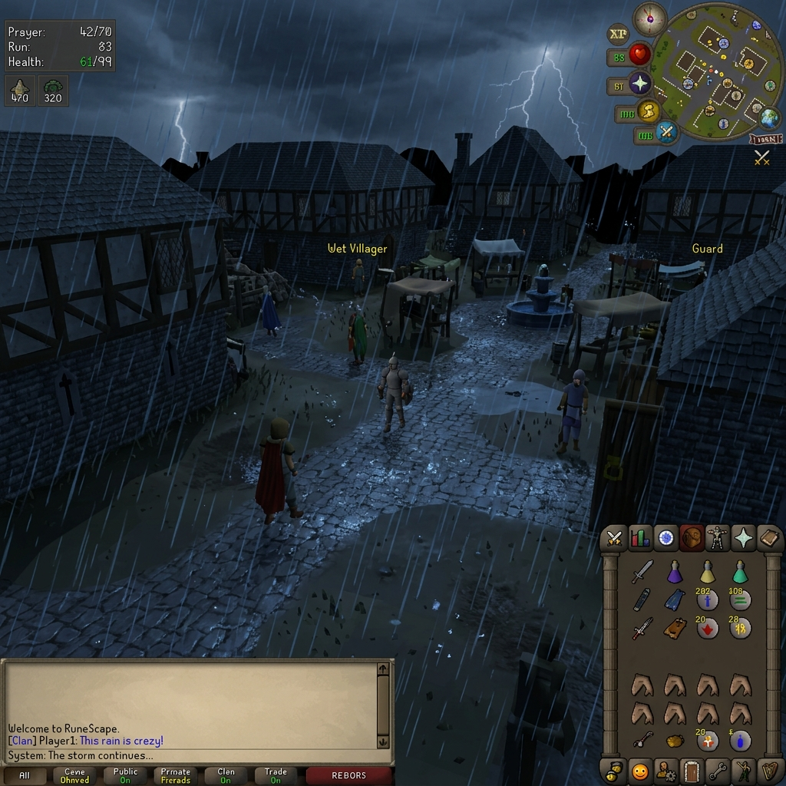
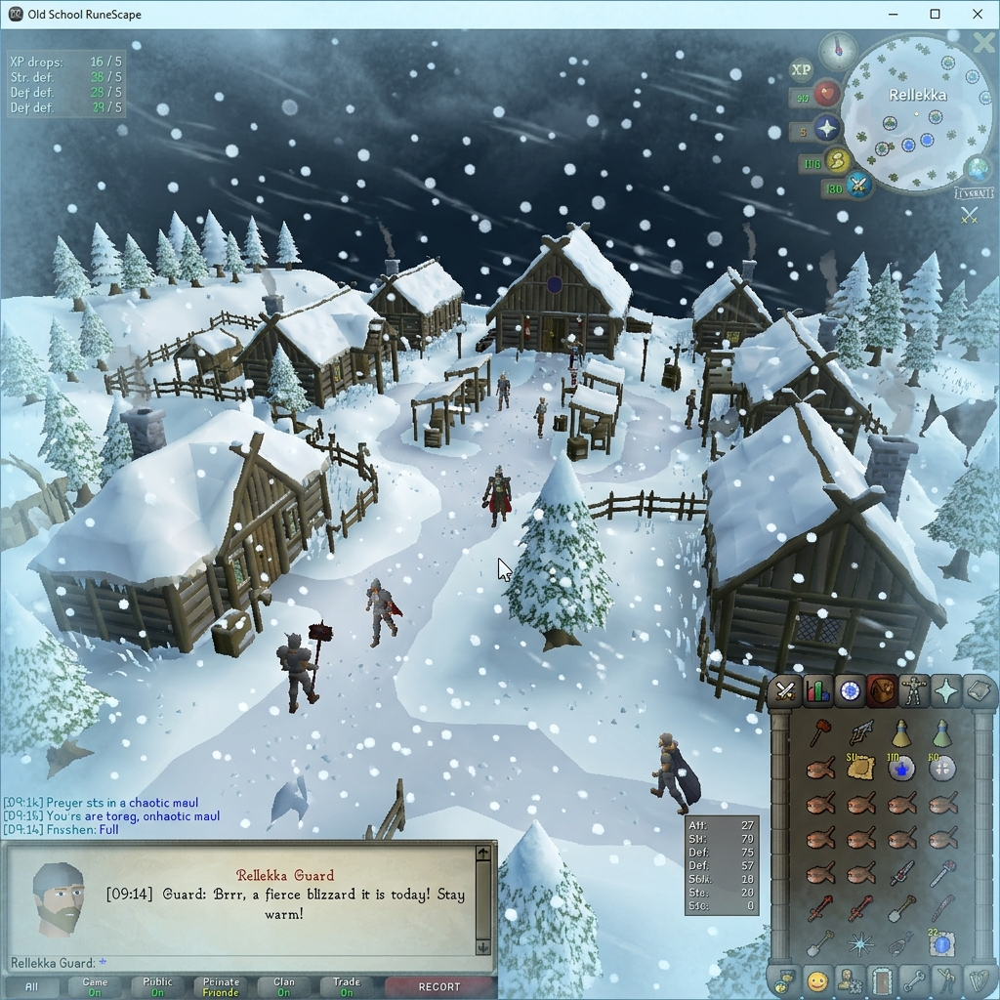
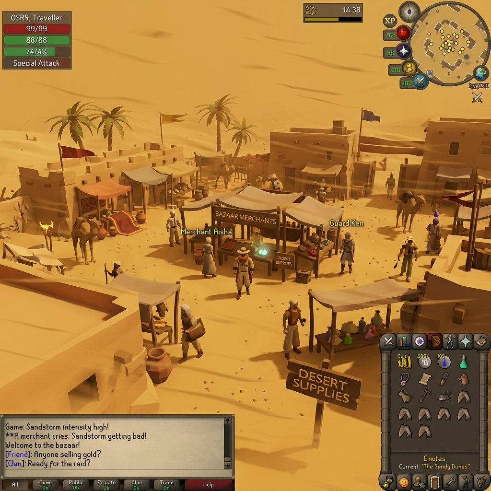
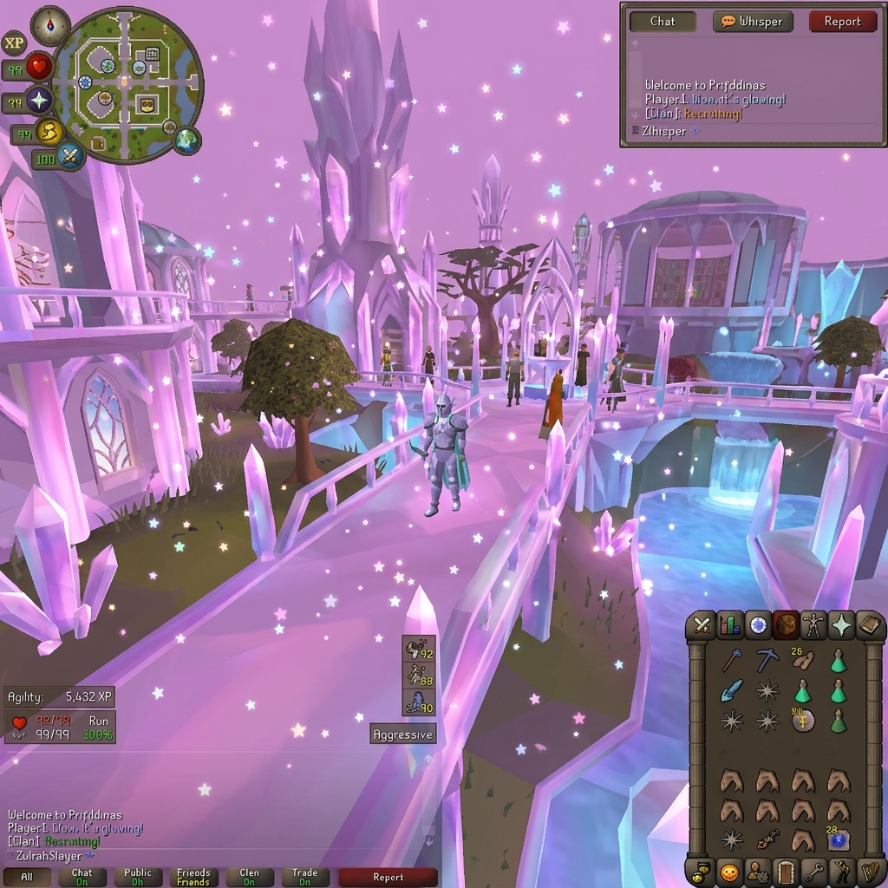
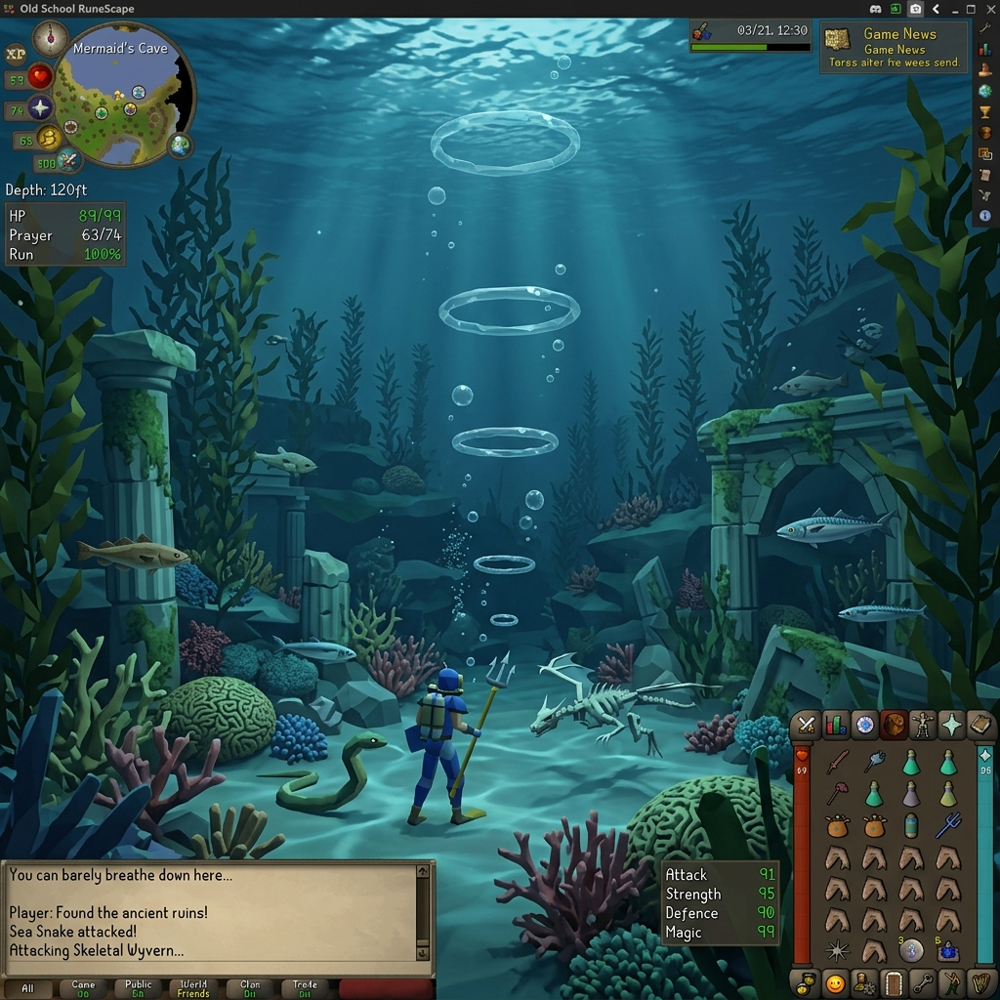
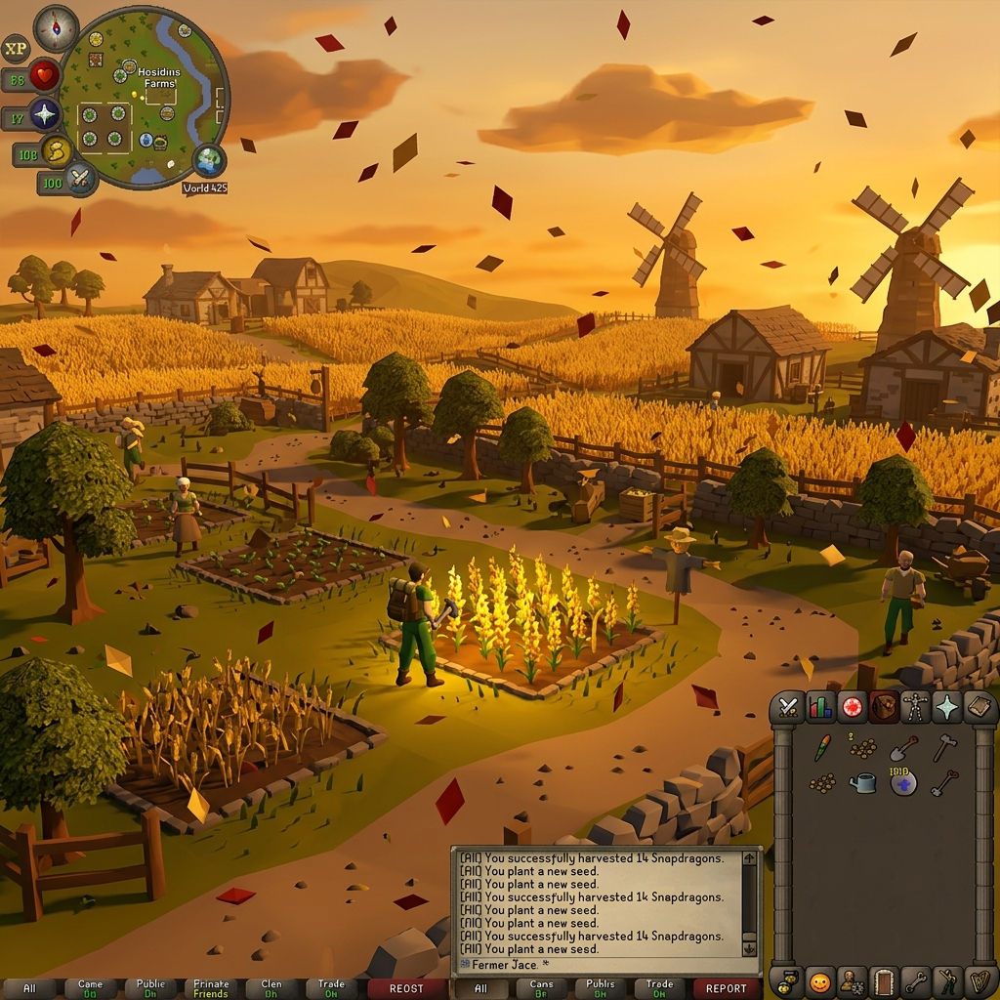
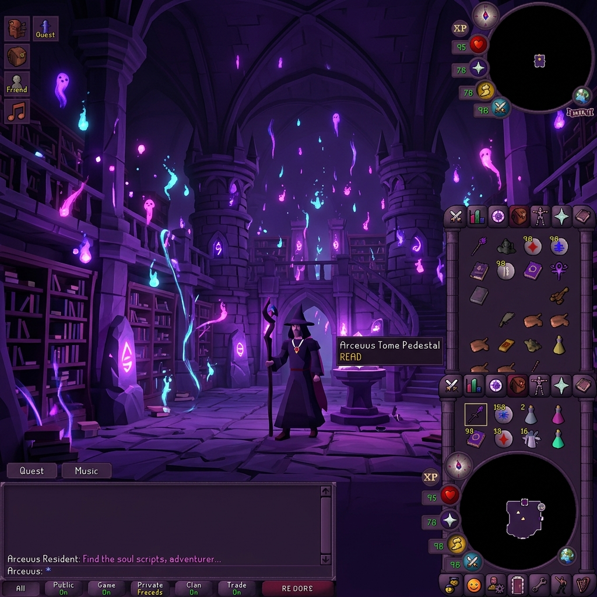
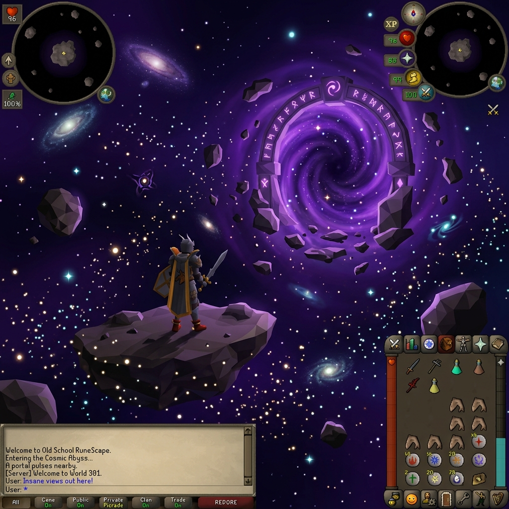

# Seasons of Gielinor 🍂⛈️❄️

**Seasons of Gielinor** is an immersive environmental visual plugin for the RuneLite client in Old School RuneScape (OSRS). It brings the world of Gielinor to life by overlaying dynamic weather particles, ambient screen color grading, and realistic physics-based wind effects that react to your movements and camera perspective.

---

## Key Features

* **🌍 Coordinate-Based Biomes**: Automatically detects your location and loads custom weather presets:
  * **Temperate (Lumbridge/Varrock)**: Rain showers and stormy grey-blue tints.
  * **Tundra (Fremennik/Weiss)**: Blizzards with swirling snowflakes and frosty ice tints.
  * **Desert (Kharidian Desert)**: Dusty sandstorms whipped by wind with warm golden-orange tints.
  * **Swamp (Morytania)**: Slow, rising green-gray fog and spooky mists.
  * **Volcanic (Mount Karuulm/Lava Maze)**: Smoldering red ashfall and glowing volcanic embers.
  * **Magical (Zanaris/Prifddinas)**: Shimmering pastel crystal dust and glowing stars.
  * **Underwater (Fossil Island depths)**: Rising bubble rings and deep aquamarine/blue tints.
  * **Savannah (Hosidius/Varlamore)**: Fluttering orange, brown, and golden autumn leaves.
  * **Arceuus (Necromantic zones)**: Neon purple and cyan wisps rising and dissolving in the air.
  * **Cosmic (The Abyss)**: Zero-gravity starry stardust blowing in chaotic directions.
* **🕒 Real-time Day/Night Cycles**: Syncs to your local timezone to dynamically overlay morning pinks, warm daylight yellows, sunset purples, and deep blue night tints.
* **🌀 Camera-Aligned Wind Physics**: Integrates with the client's 14-bit camera yaw angle. When you rotate your camera, rain drops, sand, and leaves sway and tilt dynamically.
* **⚡ Double-Flicker Lightning**: Stormy weather occasionally triggers realistic, decaying double-flickering lightning flashes that briefly illuminate the canvas.
* **🏠 Indoor Roof Hiding**: Automatically fades out weather and tints when you go upstairs (`plane > 0`), enter dungeons/caves (`Y >= 9000`), or walk into instanced boss rooms.
* **🔄 Smooth Transitions**: All particle composition ratios and screen color washes blend smoothly over a 3-second transition when changing biomes.

---

## Gallery

| Temperate Rain | Fremennik Blizzard |
| :---: | :---: |
|  |  |

| Kharidian Sandstorm | Prifddinas Crystal Dust |
| :---: | :---: |
|  |  |

| Fossil Island Underwater | Hosidius Autumn Leaves |
| :---: | :---: |
|  |  |

| Arceuus Soul Dust | Cosmic Abyss Stardust |
| :---: | :---: |
|  |  |

---

## Developer Setup

### Prerequisites
* Java 11 JDK
* An IDE (IntelliJ IDEA is highly recommended)

### Running in Development Mode
1. Clone this repository:
   ```bash
   git clone https://github.com/Nubles/seasons-of-gielinor.git
   ```
2. Open the project in IntelliJ IDEA.
3. Gradle will automatically sync and fetch the RuneLite client dependencies.
4. Locate the bootstrap file `src/test/java/com/weather/WeatherPluginTest.java`.
5. Right-click the file and select **Run 'WeatherPluginTest.main()'**.
6. The RuneLite client will launch in developer mode with the **Dynamic Weather** plugin enabled.
